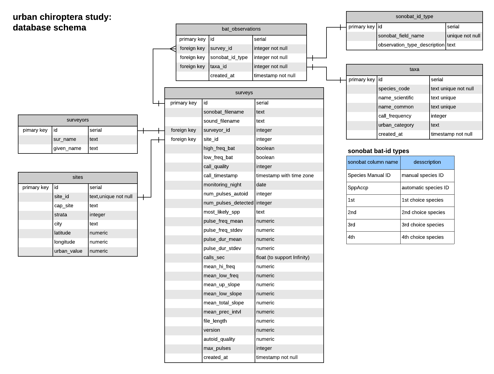

<!-- README.md is generated from README.Rmd. Please edit the latter. -->

#### overview

Code and documentation related to acoustic monitoring and analyses of bats in
the greater Phoenix metropolitan area.


#### database schema




#### uploading sonobat data

*development of upload tools in progress*

```{r upload sonobat data, eval=FALSE}

function(sonobatFile = 'sonbat file', 
         surveyLocation = 'sample site',
         surveyorSurname = 'investigator last name')
```
